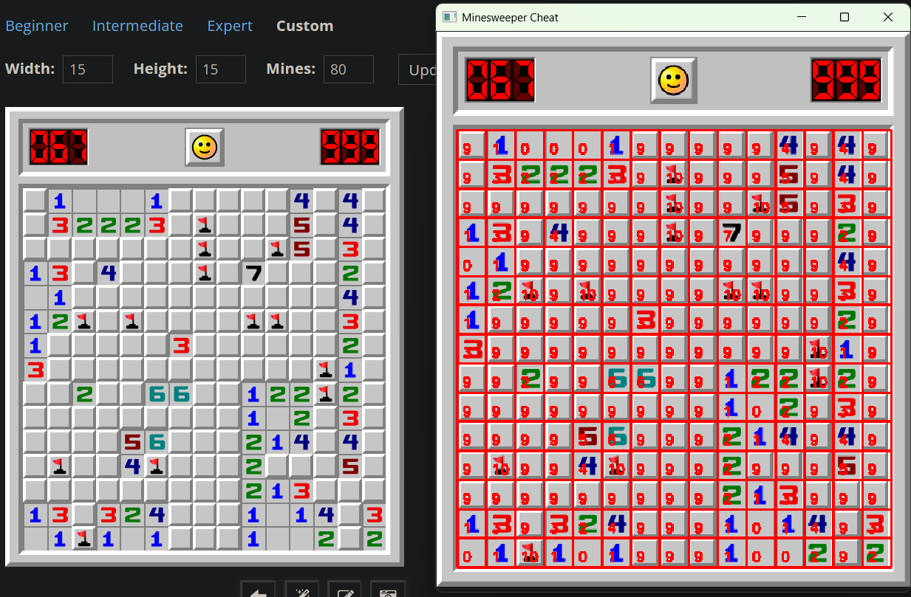
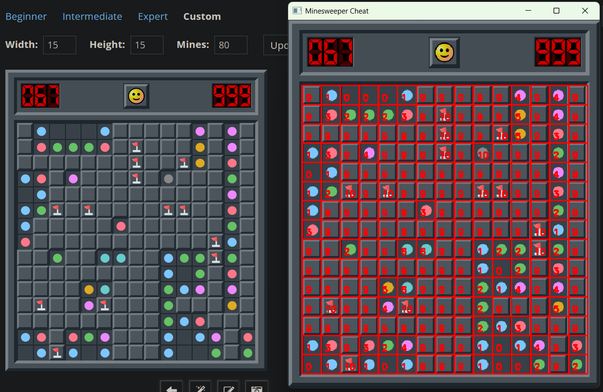
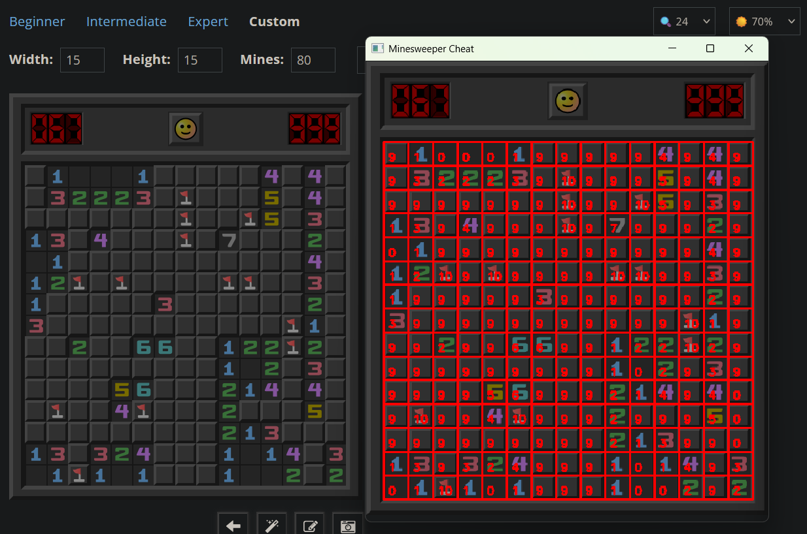

# Minesweeper Cheat

***work in progress***

This is a simple cheat for the game of minesweeper from minesweeper.online. It uses PyAutoGUI and OpenCV to recognize the state of the game. State recognition works (but not as reliably as I would like it to), actually solving the game is not done yet.

## Usage

To use, run the `minesweeper-cheat.py` file using Python (version at least 3.10.9, lower might work, but not tested) after installing all of dependencies in `requirements.txt` (lower versions might work, but not tested) with pip. After a window appears showing your screen, select (press left mouse button at one corner and unpress at the oposing corner) the game of minesweeper (selecting just the grid, exactly the game area (with the top panel with remaining flag count and time elapsed) or the game area with a bit of background around it, should all work) from `minesweeper.online`.

Press `r` to reset selection or `q` to quit.

If the state is not recognised properly, try changing the appearance mode of the game or adjusting the brightness (potentially changing it back to a preferred level in small steps).
*Random colors / letter / gems / low res modes and low zoom levels are not supported, but still may work*

## Demo

